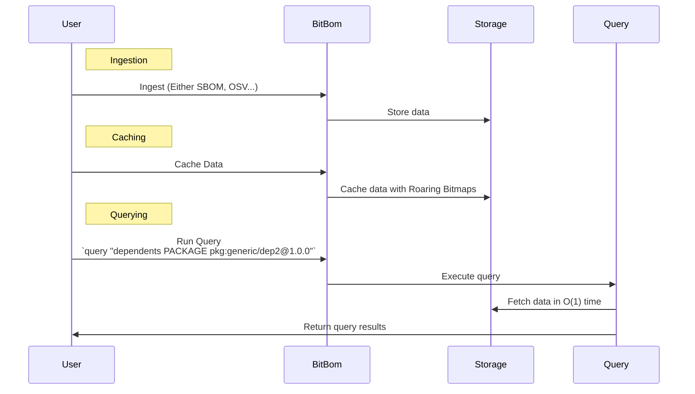
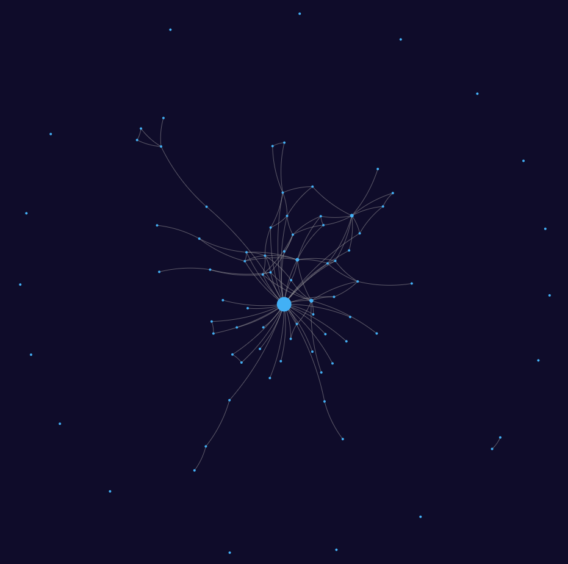

# Minefield

BitBom Minefield is a tool that uses roaring-**Bit**maps to graph S**BOM**s.

> The average user doesn't give a damn what happens, as long as (1) it works and (2) it's fast. - Daniel J. Bernstein

## What is a Roaring Bitmap

[Roaring bitmaps](https://github.com/RoaringBitmap/roaring) are a data structure that creates ginormous bitmaps (bitmasks).

A regular bitmap is an extremely space-efficient Set (Or in languages that don't use Sets, a `map[int] bool`). A Roaring Bitmap is a regular bitmap on steroids.

For instance, 32-bit integer keys mean it can theoretically store up to 2^32 different values, i.e., around 4.29 billion (Or exactly 4294967296 integers) values in a very limited amount of space (This is stated in the [Roaring Bitmap specification](https://github.com/RoaringBitmap/RoaringFormatSpec?tab=readme-ov-file#standard-32-bit-roaring-bitmap)).

## Caching

One of Minefield's main features is its speed. Minefield can perform queries in O(1) time. The only way to get O(1) time is to cache data, and then retrieve from the cache.

There are two primary challenges with caches: they are memory-intensive, which may not be desirable for many users, and it is usually time intensive to create the cache. Most caches take an exponential amount of time to cache the entire graph, which becomes problematic as the number of nodes and connections increases.

For example, caching 100,000 nodes, each with 10 edges, using traditional methods would take O(n^2 * m) time, where n is the number of nodes and m is the number of edges.

This would take approximately 16.67 minutes if each operation took 1 nanosecond. While this duration is manageable when caching once or twice daily. This becomes more infeasible as the scale increases. Caching 10 million nodes each with 100 connections would involve 10^18 operations, taking 31.7 years if each operation took 1 nanosecond. This duration is clearly unacceptable.

Minefield addresses both the space and time issues in caching.

Roaring Bitmaps, which are very lightweight data structures, effectively utilize storage space. These bitmaps store the complete cache, as they can efficiently represent each dependency and dependent in a single Roaring Bitmap.

Minefield effectively handles time by utilizing a pre-compute cache that stores every potential query in the graph. This process takes O(n * m) time, where n represents the number of nodes and m represents the number of connections. Once a node has been processed and stored in the cache, it won't be revisited.

This is possible by breaking down the caching problem like a Dynamic Programming problem, where recursive sub-problems are solved and combined to address the next query without redoing work. In this approach, each node's dependents and dependencies are calculated by summing its own dependencies and dependents along with those of its dependencies and dependents.

While this might sound complex, it allows the Minefield cache to be incredibly efficient.

Returning to our earlier example, caching 100,000 nodes with 10 connections each, with each operation taking 1 nanosecond, would take around 16 minutes using a traditional cache. With Minefield's cache, this would take just 1 millisecond. For 10 million nodes, each with 100 connections, a traditional cache would take 31.7 years, whereas Minefield's cache would take just 1 second.

The difference of 1 second versus 31.7 years is monumental.

## Overview of BitBom

This sequence diagram provides a high-level overview of how Minefield operates from a user's perspective:

This diagram illustrates the interactions between the user, Minefield, and its components, focusing on the data ingestion, caching, and querying processes.



## To start using Minefield

### Using Docker

```sh
docker pull ghcr.io/bit-bom/minefield:latest
docker run -it ghcr.io/bit-bom/minefield:latest
```

### Building from source

```sh
git clone https://github.com/bit-bom/minefield.git
cd minefield
go build -o minefield main.go
./minefield
```

### Using go install

```sh
go install github.com/bit-bom/minefield@latest
minefield
```

### Quickstart guide

1. Ingest some data: 'minefield ingest sbom <sbom_file or sbom_dir>'  
2. Cache the data: 'minefield cache'
3. Run a query: 'minefield query <query_string>'

### Example

1. Ingest the `test` SBOM directory:
    ```sh
    minefield ingest sbom test
    ```
2. Cache the data:
    ```sh
    minefield cache
    ```
3. Run the leaderboard custom with "dependents PACKAGE":
    - This command generates a ranked list of packages, ordered by the number of other packages that depend on them
    ```sh
    minefield leaderboard custom "dependents PACKAGE"
    ```
4. Run a query on the top value from the leaderboard:
    - This command is now querying the dependents for a specific package, in this case dep2
    ```sh
    minefield query "dependents PACKAGE pkg:generic/dep2@1.0.0" 
    ```
5. Run queries to see the shared dependencies of lib-A and dep1, and lib-A and lib-B
    - These queries output the intersection of two queries, in this case we are finding package dependencies do each of the packages share between each other.
    ```sh
    minefield query "dependencies PACKAGE pkg:generic/dep1@1.0.0 and dependencies PACKAGE pkg:generic/lib-A@1.0.0" 
    ```
    ```sh
    minefield query "dependencies PACKAGE pkg:generic/lib-B@1.0.0 and dependencies PACKAGE pkg:generic/lib-A@1.0.0" 
    ```
6. Run queries with the visualizer
     ```sh
    minefield query "dependents PACKAGE pkg:generic/dep2@1.0.0" 
    ```
   ###### Bitbom's visualization on a query
   

## Acknowledgements

- https://github.com/RoaringBitmap/roaring
