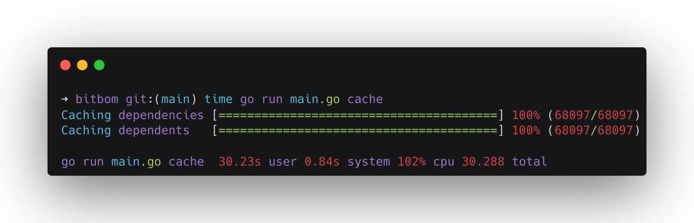
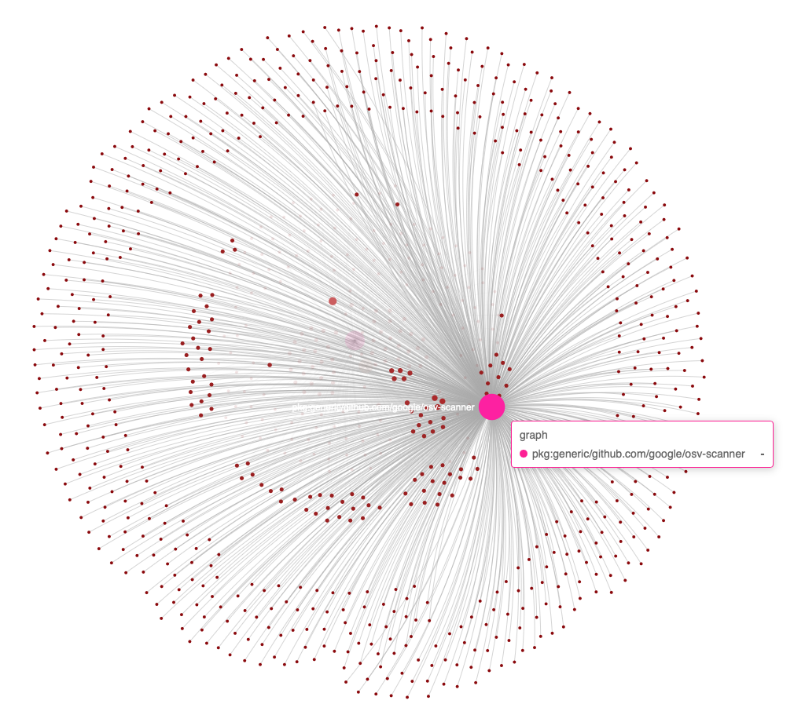

<p align="center">
  
</p>

[](https://goreportcard.com/report/github.com/bitbomdev/minefield)
[](https://github.com/bitbomdev/minefield/actions/workflows/build.yaml)


**BitBom** Minefield uses roaring **Bit**maps to graph S**BOM**s with four main fundamentals:

* **Speed**: Optimized for rapid data processing.
* **Air-Gapped**: Operates securely in isolated environments.
* **Scalable**: Supports millions of nodes effortlessly.
* **Customizable**: Allows users to extend the project without relying on upstream changes.

---

>Before moving on, please consider giving us a GitHub star ⭐️. Thank you!

---


## Documentation

For comprehensive guides and detailed documentation, please visit our [Docs](https://bitbom.dev/docs).

---



> Caching 10,000 SBOMs packages transitive dependents in 30 seconds.

## Table of Contents

1. [Quickstart Guide](#quickstart-guide)
2. [Example](#example)
3. [To Start Using Minefield](#to-start-using-minefield)
   - [Using Docker](#using-docker)
   - [Building From Source](#building-from-source)
4. [How Minefield Works](#how-minefield-works)
   - [Air-Gapped Design Philosophy](#air-gapped-design-philosophy)
5. [Visualization of a Query](#visualization-of-a-query)
6. [Documentation](#documentation)
7. [Blog](#blog)
8. [Star History](#star-history)
9. [Acknowledgements](#acknowledgements)

[View Minefield demo on asciinema](https://asciinema.org/a/674302)

## Quickstart Guide
1. **Start the server**
   ```sh
   minefield server
   ```

2. **Ingest some data:**
   ```sh
   minefield ingest sbom <sbom_file or sbom_dir>
   ```
3. **Cache the data:**
   ```sh
   minefield cache
   ```
4. **Run a query:**
   ```sh
   minefield query <query_string>
   ```

### Example

1. **Start the API server:**
   ```sh
   minefield server 
   ```

2. **Ingest the `testdata/small` SBOM directory:**
    ```sh
    minefield ingest sbom testdata/small
    ```
3. **Cache the data:**
    ```sh
    minefield cache
    ```
4. **Run the leaderboard custom with "dependents library":**
   - This command generates a ranked list of packages, ordered by the number of other packages that depend on them.
    ```sh
    minefield leaderboard custom "dependents library"
    ```
5. **Run a query on the top value from the leaderboard:**
   - This command queries the dependents for a specific package, in this case `dep2`.
    ```sh
    minefield query custom "dependents library pkg:dep2@1.0.0"
    ```
6. **Run queries to see the shared dependencies of `lib-A` and `dep1`, and `lib-A` and `lib-B`:**
   - These queries output the intersection of two queries, finding package dependencies shared between each pair.
    ```sh
    minefield query custom "dependencies library pkg:lib-B@1.0.0 and dependencies library pkg:lib-A@1.0.0"
    ```
## To Start Using Minefield

### Using Docker

```sh
docker pull ghcr.io/bitbomdev/minefield:latest
docker run -it ghcr.io/bitbomdev/minefield:latest
```

### Building From Source

```sh
git clone git@github.com:bitbomdev/minefield.git
cd minefield
go build -o minefield main.go
./minefield
```

## How Minefield Works

The design decisions and architecture of Minefield can be found [here](paper.md).

### Air-Gapped Design Philosophy

Minefield is primarily designed as an air-gapped solution, operating seamlessly without internet connectivity. It makes it ideal for secure environments that require complete isolation from external networks.

- **Offline Operation**: All functionalities, including data ingestion, caching, querying, and visualization, are performed locally without external dependencies.

- **Enhanced Security**: Operating in an air-gapped environment minimizes the risk of data breaches and unauthorized access, ensuring that sensitive information remains within your controlled infrastructure.

- **Data Sovereignty**: Users have complete control over their data, with no external transmissions, adhering to strict compliance and regulatory requirements.

- **Efficiency**: Minefield is optimized for performance and can handle large datasets quickly even without network resources.

Minefield makes it easy to securely and efficiently manage and explore your software dependencies within isolated environments by offline processing and analyzing SBOMs (Software Bill of Materials).

## Visualization of a Query



## Blog

Stay updated with the latest news and insights by visiting our [Blog](https://bitbom.dev/blog).

## Star History

[](https://star-history.com/#bitbomdev/minefield&Date)

## Acknowledgements

- https://github.com/RoaringBitmap/roaring
