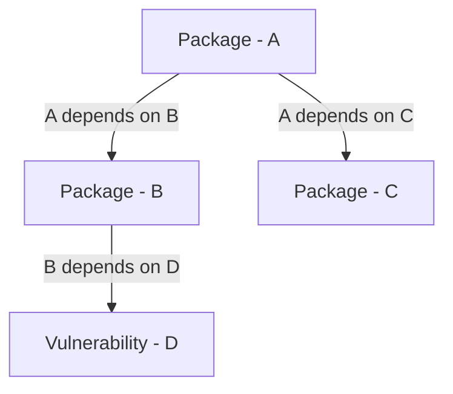

# bitbom

Bitbom graphs sboms using [Roaring BitMaps](https://github.com/RoaringBitmap/roaring).

The idea of bitbom is to have a similar functionality to `guacsec/guac`, but using a different storage implementation.

Bitbom takes in sboms and then uses protobom to read them so that we can graph nodes.

The graph is then created to represent nodes connecting to other nodes without specific edge nodes (This is partially where it differentiates from `guacsec/guac`).

For example, if we have 3 package nodes and vulnerability node, we could use the Roaring Bitmap to create a graph like:

---

## How the graph is constructed with a bitmap

Each node has its own bitmap, and then a dependency graph is created by adding the child node into the parent nodes bitmap.

---

## Understand dependencies

In bitbom there aren't dependency nodes unlike `guacsec/guac`.
Without the dependency nodes the graph is a bit more simple and easier to understand.

Without any type of dependency nodes we know which nodes depend on which by pointing a specific node to another via an edge.