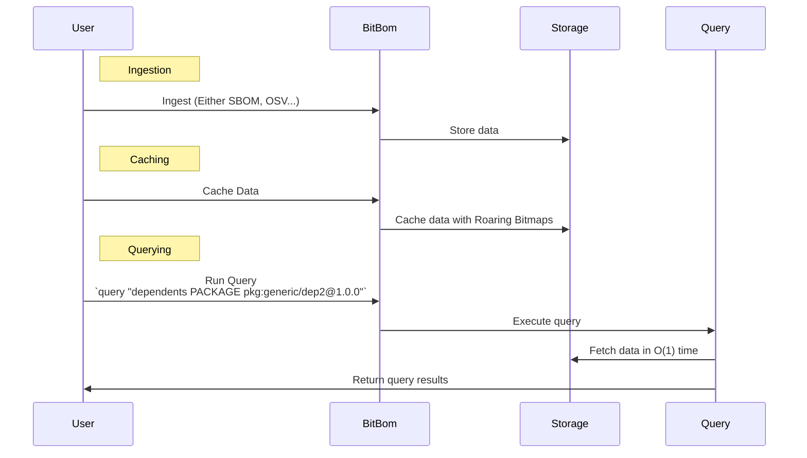

# Minefield

BitBom Minefield is a tool that uses roaring-**Bit**maps to graph S**BOM**s.

## What is a Roaring Bitmap

[Roaring bitmaps](https://github.com/RoaringBitmap/roaring) are a data structure that creates ginormous bitmaps.

A regular bitmap is an extremely space-efficient Set (Or in languages that don't use Sets, a `map[int] bool`). A Roaring Bitmap is a regular bitmap on steroids.

For instance, 32-bit integer keys mean it can theoretically store up to 2^32 different values, i.e., around 4.29 billion (Or exactly 4294967296 integers) values in a very limited amount of space (This is stated in the [Roaring Bitmap specification](https://github.com/RoaringBitmap/RoaringFormatSpec?tab=readme-ov-file#standard-32-bit-roaring-bitmap)).

## Overview of BitBom

This sequence diagram provides a high-level overview of how Minefield operates from a user's perspective:

This diagram illustrates the interactions between the user, Minefield, and its components, focusing on the data ingestion, caching, and querying processes.



## To start using Minefield

### Using Docker

```sh
docker pull ghcr.io/bit-bom/minefield:latest
docker run -it ghcr.io/bit-bom/minefield:latest
```

### Building from source

```sh
git clone https://github.com/bit-bom/minefield.git
cd minefield
go build -o minefield main.go
./minefield
```

### Using go install

```sh
go install github.com/bit-bom/minefield@latest
minefield
```

### Quickstart guide

1. Ingest some data: 'minefield ingest sbom <sbom_file or sbom_dir>'  
2. Cache the data: 'minefield cache'
3. Run a query: 'minefield query <query_string>'

### Example

1. Ingest the `test` SBOM directory:
    ```sh
    minefield ingest sbom test
    ```
2. Cache the data:
    ```sh
    minefield cache
    ```
3. Run the leaderboard custom with "dependents PACKAGE":
    - This command generates a ranked list of packages, ordered by the number of other packages that depend on them
    ```sh
    minefield leaderboard custom "dependents PACKAGE"
    ```
4. Run a query on the top value from the leaderboard:
    - This command is now querying the dependents for a specific package, in this case dep2
    ```sh
    minefield query "dependents PACKAGE pkg:generic/dep2@1.0.0" 
    ```
5. Run queries to see the shared dependencies of lib-A and dep1, and lib-A and lib-B
    - These queries output the intersection of two queries, in this case we are finding package dependencies do each of the packages share between each other.
    ```sh
    minefield query "dependencies PACKAGE pkg:generic/dep1@1.0.0 and dependencies PACKAGE pkg:generic/lib-A@1.0.0" 
    ```
    ```sh
    minefield query "dependencies PACKAGE pkg:generic/lib-B@1.0.0 and dependencies PACKAGE pkg:generic/lib-A@1.0.0" 
    ```
   

## Acknowledgements

- https://github.com/RoaringBitmap/roaring
- https://github.com/protobom/protobom
